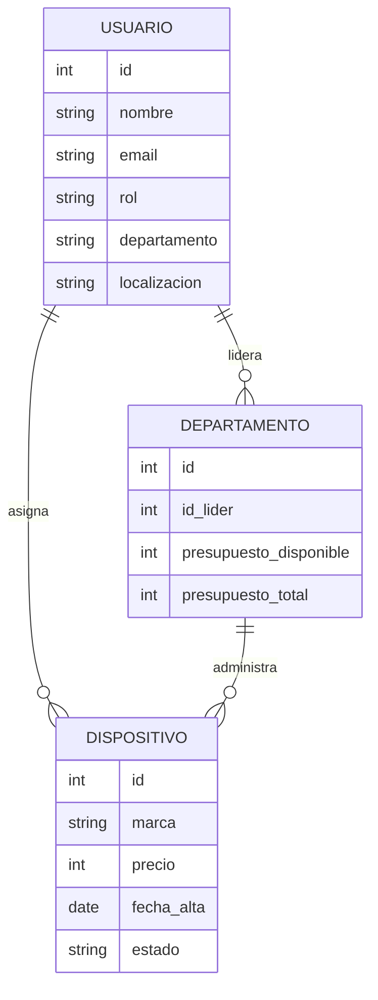
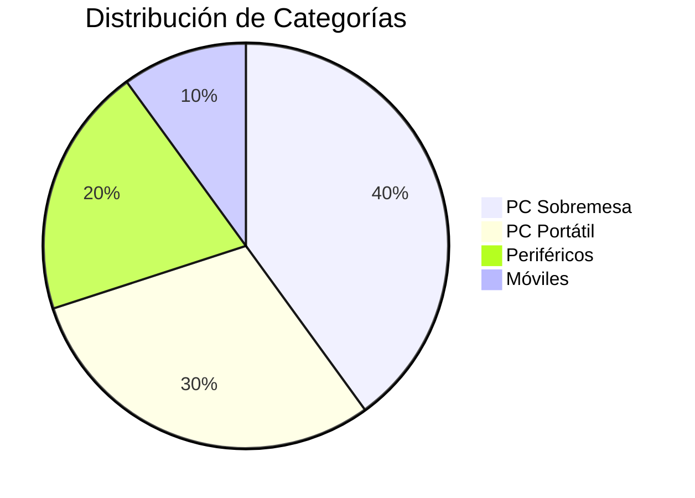
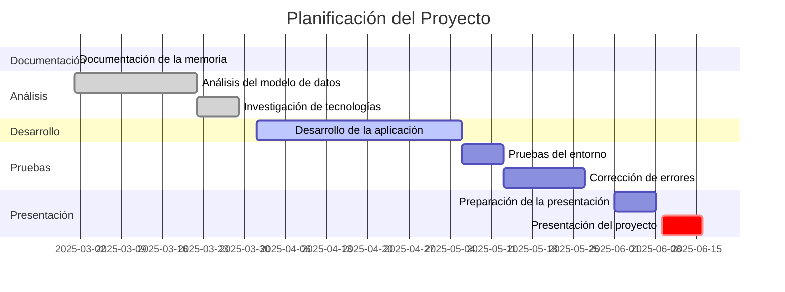

  

# :package: Inventario y Gestión de Personal
## :sparkles: Descripción del Proyecto

*Este proyecto está diseñado para centralizar la gestión de altas y bajas de usuarios, inventarios de dispositivos y accesorios, así como las asignaciones de dispositivos para cada persona.*

---

## :dart: Objetivos

- Centralizar la gestión de altas y bajas de los usuarios de una empresa.
- Centralizar el inventario de dispositivos y accesorios.
- Gestionar las asignaciones de dispositivos para cada persona.

---

## :no_entry_sign: Vinculación a empresa

- **No**

---

## :hammer_and_wrench: Actividades a realizar

- Análisis del modelo de datos.
- Análisis y desarrollo de casos de uso.
- Desarrollo de la aplicación.
- Pruebas del entorno.

---

## :toolbox: Recursos necesarios para la ejecución

1. **Figma**
2. **Android Studio** 
3. **Kotlin/Java** 

---

## :bar_chart: Imágenes y diagramas

### Posible modelo de datos

### Estimación de dispositivos

### Planificación

---

## :clipboard: Hacks y Tips

- Usar **Figma** para diseñar las interfaces del usuario.
- Prueba el entorno en dispositivos reales para evitar errores de compatibilidad.

---

## :tv: Vídeos relacionados

---

## :memo: Tabla de funcionalidades

| Función               | Descripción                           | Estado       |
|-----------------------|---------------------------------------|--------------|
| Gestión de usuarios   | Altas y bajas de usuarios             | Pendiente      |
| Inventario de equipos | Control y registro de dispositivos    | Pendiente  |
| Asignaciones          | Asignación de dispositivos a personas | Pendiente    |

:tada: ¡Una vez se acabe esto si todo va bien tendremos el título!
